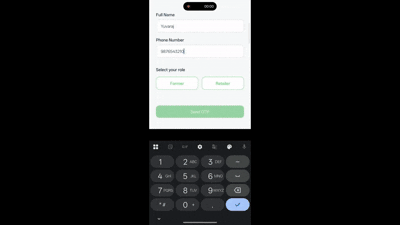

# SVA AgroMart - React Native App

## 🌱 About

SVA AgroMart is a comprehensive agricultural marketplace mobile application connecting farmers and retailers. Built with React Native, Expo, and Firebase.

## 🎬 App Previews

**Farmer Experience**


**Retailer Experience**



## ✨ Features

- 🔐 **Phone Authentication** - Secure login with OTP verification
- 👨‍🌾 **Dual Roles** - Separate interfaces for Farmers and Retailers
- 🛍️ **Product Catalog** - Browse seeds, fertilizers, and pesticides
- 🌤️ **Weather Widget** - Real-time weather information for farmers
- 🔍 **Crop Disease Detection** - AI-powered disease identification (coming soon)
- 💬 **Community Forum** - Connect with other farmers
- 🛒 **Shopping Cart** - Easy product ordering
- 🌐 **Multi-language** - English and Hindi support

## 🚀 Quick Start

### Prerequisites

- Node.js 18+ 
- npm or yarn
- Expo CLI
- Android Studio (for Android) or Xcode (for iOS)

### Installation

1. **Clone the repository**
   ```bash
   git clone <repository-url>
   cd SVA_Rnative
   ```

2. **Install dependencies**
   ```bash
   npm install
   ```

3. **Configure environment**
   ```bash
   cp .env.example .env
   # Edit .env with your configuration
   ```

4. **Start development server**
   ```bash
   npm run dev
   # or
   npx expo start
   ```

5. **Run on device/emulator**
   - Press `a` for Android
   - Press `i` for iOS
   - Scan QR code with Expo Go app

## 📱 Running on Emulator

### Android
```bash
npm run android
```

### iOS (Mac only)
```bash
npm run ios
```

### Web
```bash
npm run web
```

## 🔧 Configuration

### Firebase Setup

See [FIREBASE_SETUP.md](./FIREBASE_SETUP.md) for detailed Firebase configuration instructions.

Quick setup for development:
- Default OTP: `123456`
- No Firebase config needed in dev mode
- Auth persists across app restarts

### Environment Variables

Create a `.env` file with:

```env
# Firebase
EXPO_PUBLIC_FIREBASE_API_KEY=your_key
EXPO_PUBLIC_FIREBASE_AUTH_DOMAIN=your_domain
EXPO_PUBLIC_FIREBASE_PROJECT_ID=your_project
EXPO_PUBLIC_FIREBASE_STORAGE_BUCKET=your_bucket
EXPO_PUBLIC_FIREBASE_MESSAGING_SENDER_ID=your_sender_id
EXPO_PUBLIC_FIREBASE_APP_ID=your_app_id

# API
EXPO_PUBLIC_API_BASE_URL=https://api.sva-agromart.com
EXPO_PUBLIC_WEATHER_API_KEY=your_weather_api_key

# Environment
EXPO_PUBLIC_APP_ENV=development
```

## 🏗️ Project Structure

```
SVA_Rnative/
├── app/                      # Expo Router screens
│   ├── (tabs)/              # Bottom tab navigation
│   │   ├── home.tsx
│   │   ├── catalog.tsx
│   │   ├── forum.tsx
│   │   └── profile.tsx
│   ├── auth/                # Authentication screens
│   │   ├── login.tsx
│   │   └── verify-otp.tsx
│   ├── crop-disease/        # Crop disease detection
│   └── product/             # Product details
├── src/
│   ├── components/          # Reusable components
│   ├── config/              # Configuration files
│   │   └── firebase.ts
│   ├── services/            # API services
│   │   ├── authService.ts
│   │   ├── productService.ts
│   │   ├── weatherService.ts
│   │   └── cropDiseaseService.ts
│   ├── store/               # Redux store
│   │   ├── index.ts
│   │   └── slices/
│   └── utils/               # Utility functions
│       └── i18n.ts
├── styles/                  # Global styles
├── assets/                  # Images, fonts, etc.
└── .env                     # Environment variables
```

## 🔐 Authentication Flow

1. User enters phone number (10 digits)
2. Selects role: **Farmer** or **Retailer**
3. OTP sent to phone (or use `123456` in dev mode)
4. OTP verification
5. Automatic login and auth persistence
6. Auto-login on app restart

## 🎨 Tech Stack

- **Framework:** React Native with Expo
- **Navigation:** Expo Router
- **State Management:** Redux Toolkit
- **Authentication:** Firebase Auth
- **Storage:** AsyncStorage
- **UI Components:** React Native Paper
- **Styling:** StyleSheet
- **Internationalization:** i18next
- **HTTP Client:** Axios

## 📦 Available Scripts

```bash
npm run dev        # Start with tunnel (for device testing)
npm run android    # Run on Android
npm run ios        # Run on iOS
npm run web        # Run on web browser
npm run lint       # Lint code
npm run build:web  # Build for web
npm run build:android  # Build Android APK
```

## 🧪 Testing Credentials

**Development Mode:**
- Phone: Any 10-digit number (e.g., `9876543210`)
- OTP: `123456`
- Role: Farmer or Retailer

## 🌍 Internationalization

Switch language in Profile > Settings

Supported languages:
- 🇬🇧 English
- 🇮🇳 हिंदी (Hindi)

## 🐛 Known Issues

- Weather API needs real API key for production
- Crop disease detection is mock data (AI integration pending)
- Forum posting not yet implemented
- Product images are placeholder URLs

## 🔜 Upcoming Features

- [ ] Real crop disease AI detection
- [ ] Payment gateway integration
- [ ] Order tracking
- [ ] Push notifications
- [ ] Offline mode
- [ ] Government schemes integration
- [ ] Expert consultation booking

## 🤝 Contributing

1. Fork the repository
2. Create your feature branch (`git checkout -b feature/AmazingFeature`)
3. Commit your changes (`git commit -m 'Add some AmazingFeature'`)
4. Push to the branch (`git push origin feature/AmazingFeature`)
5. Open a Pull Request

## 📄 License

This project is licensed under the MIT License.

## 📞 Support

For support, email support@sva-agromart.com or join our community forum.

## 👥 Team

SVA AgroMart Development Team

---

Made with ❤️ for farmers in India
